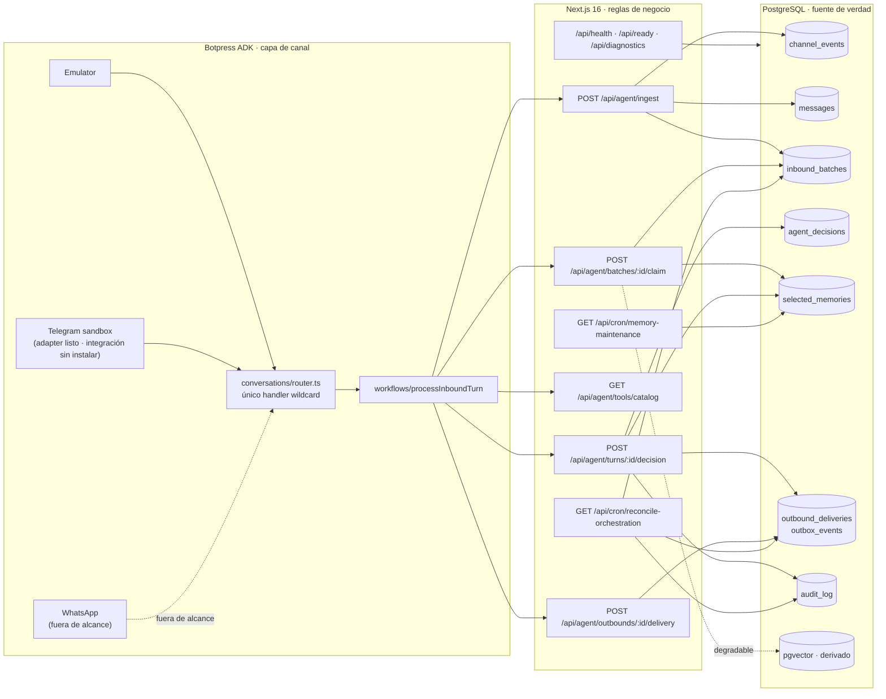
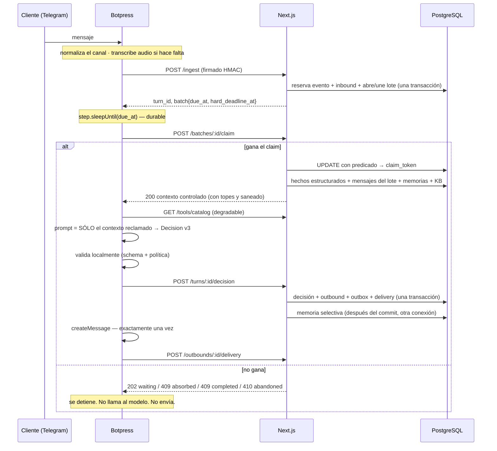
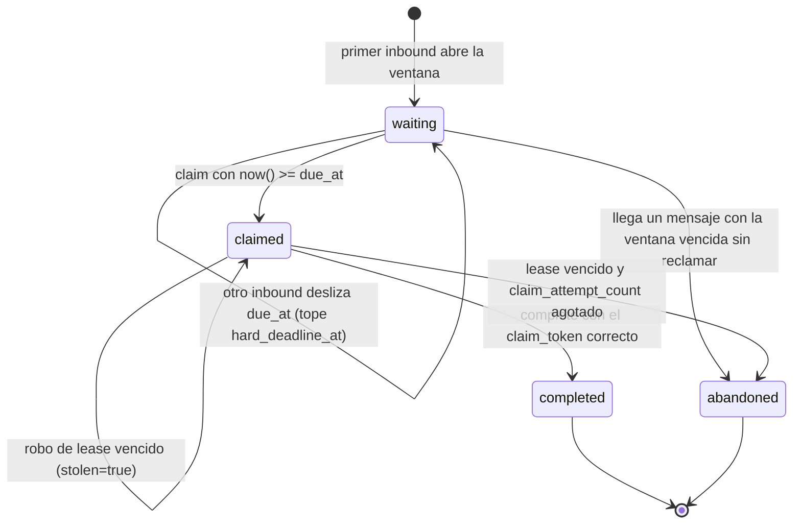
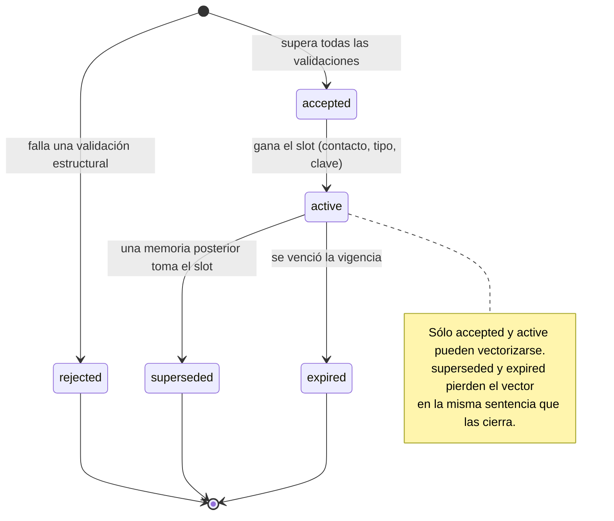
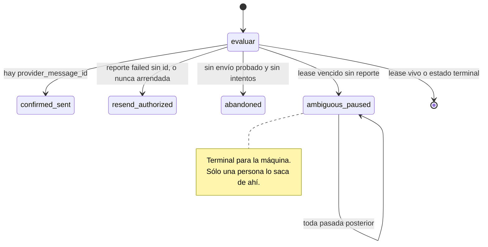

# Mapa del orquestador StudyX

Estado real del código al 2026-08-11 (fin de la fase 8), no el estado deseado.
Cada casilla dice si está implementada, verificada y con qué prueba. Cuando esta
página y el código no coincidan, gana el código y esta página es el bug.

## Fronteras



Botpress nunca toca PostgreSQL. No hay credenciales de base en el agente.
El catálogo es **sólo lectura**: no existe contraparte de escritura en ninguna
ruta que el agente pueda alcanzar.

## Recorrido de un turno



## Estados del lote



## Estados de una memoria seleccionada



## Reconciliación de una entrega



## Estado por requisito

| Área | Estado | Dónde | Prueba |
|---|---|---|---|
| Ingesta idempotente | ✅ | `ingestion.service.ts` | `orchestration-lifecycle.test.ts` |
| Un inbound por evento externo | ✅ | `reserve_inbound_channel_event` | `database-invariants.test.ts` |
| Payloads jsonb canónicos | ✅ | `lib/db/json.ts` | `jsonb-canonical-persistence.test.ts` |
| Batching durable | ✅ | `20260811020001_inbound_batches.sql` | `inbound-batching.test.ts` |
| Claim con dueño único | ✅ | `claim_inbound_batch` | `inbound-batching.test.ts` (5 concurrentes) |
| Contexto sólo después del claim | ✅ | `application/claim-batch.ts` | `claim-context.test.ts` |
| Política de turno unificada | ✅ | `domain/turn-policy.ts` | `turn-policy.test.ts` |
| **`selected_memories`** | ✅ | `20260811030001_selected_memories.sql` | `selected-memories.test.ts` (13) |
| **Validación de memory candidates** | ✅ | `domain/memory-selection.ts` | `memory-selection.test.ts` (26), `select-memories.test.ts` (9) |
| **Embedding de memoria asíncrono** | ✅ | `/api/cron/memory-maintenance` | `selected-memories.test.ts` |
| **Recuperación limitada a 2–5** | ✅ | `search_selected_memories` + `capRetrievedItems` | `selected-memories.test.ts` |
| **KB en el contrato de Botpress** | ✅ | `ClaimedTurnSchema` | `botpress-response-parity.test.ts` |
| **Límites y saneado de KB** | ✅ | `domain/retrieved-context.ts` | `retrieved-context.test.ts` (11) |
| **Catálogo conectado al workflow** | ✅ | `actions/lookupCatalog.ts` + `domain/catalog-view.ts` | `catalog-view.test.ts` (10) |
| **Decision v3 en uso** | ✅ | `decision.service.ts` (`parseDecisionAny`) | `decision-v3.test.ts` (7), `decision-v3-policy.test.ts` (10) |
| **Workflow con claim y espera durable** | ✅ | `processInboundTurn` (`step.sleepUntil`) | `botpress-response-parity.test.ts`; end-to-end ⛔ EXT-05 |
| **Reconciliador de claims** | ✅ | `application/reconcile-orchestration.ts` | `reconcile-orchestration.test.ts` (11) |
| **Reconciliador de outbox** | ✅ | `20260811050001_orchestration_reconciliation.sql` | `delivery-reconciliation.test.ts` (15) |
| **Entrega ambigua nunca se reenvía** | ✅ | `domain/delivery-reconciliation.ts` | `delivery-reconciliation.test.ts` |
| **`/api/health`, `/api/ready`** | ✅ | `src/app/api/{health,ready}` | `readiness.test.ts` (9), `health-readiness.test.ts` (5) |
| **Diagnóstico separado de degradables** | ✅ | `/api/diagnostics` | `health-readiness.test.ts` |
| **Logs con trace_id y latencia por etapa** | ✅ | `observability/structured-log.ts` (`withTrace`, `timedStage`) | — |
| Degradación de pgvector/Gemini | ✅ | `claim-batch.ts` (`allSettled`) | `claim-batch.test.ts`, `claim-context.test.ts` |
| Aislamiento por contacto | ✅ | FKs compuestas + funciones contact-scoped | `claim-context.test.ts`, `selected-memories.test.ts` |
| Cero handoff humano | ✅ | schema productor + política + CHECK | `decision-v3.test.ts` |
| Acciones comerciales deshabilitadas | ✅ | lista blanca de dos acciones observacionales | `decision-v3-policy.test.ts` |
| Evals conversacionales | ⛔ EXT-04 | `evals/*.eval.ts` escritas | requieren la integración `chat` |
| Piloto real por Telegram | ⛔ EXT-05 | adapter listo | requiere `adk integrations add telegram` |
| Worker de outbound (reenvío físico) | ❌ | — | ver «no implementado» |
| Audio detrás de un puerto | ❌ | `transcribeAudio` se llama directo | — |
| Pruebas de carga | ❌ | — | — |
| WhatsApp oficial | ❌ fuera de alcance | — | — |

## Desviaciones respecto de los planes escritos

1. El plan piloto nombra `src/conversations/emulator.ts`; el código real usa
   `router.ts` con adapters en `src/channels/`. El código es correcto: un solo
   handler wildcard, como exige `.claude/rules/botpress.md`.
2. El plan piloto congela Decision v2. La consigna vigente pidió v3, ya migrada
   de forma aditiva: v2 sigue siendo válido en el alambre.
3. El ADK no expone `tools` de forma verificable en sus tipos, así que el
   catálogo se **inyecta como dato estructurado** en la cerca no confiable en
   vez de exponerse como herramienta con loop. Cumple lo mismo —Botpress no
   toca PostgreSQL, el modelo no puede escribir— y es determinista para evals.
4. Un reenvío autorizado **no** mueve `state`: `pending` y `failed_retryable` ya
   son los estados desde los que un worker toma la entrega, y la máquina de
   estados de la fase 1 sólo permite salir de ellos hacia `leased`. El veredicto
   vive en `reconciliation_state`.
5. `docs/ROADMAP.md` invariante 6 todavía dice «OpenAI»; el proyecto usa Gemini.

## Verificación: sin Docker

```bash
./scripts/pg-native-up.sh 55433
TEST_DATABASE_URL=postgresql://postgres@127.0.0.1:55433/studyx_test npm run test:integration
./scripts/pg-native-down.sh 55433
bash scripts/verify-native-postgres-loop.sh   # equivale a test:db:reset-loop
```

`supabase db lint` y `supabase test db` (pgTAP) siguen bloqueados por Docker.
