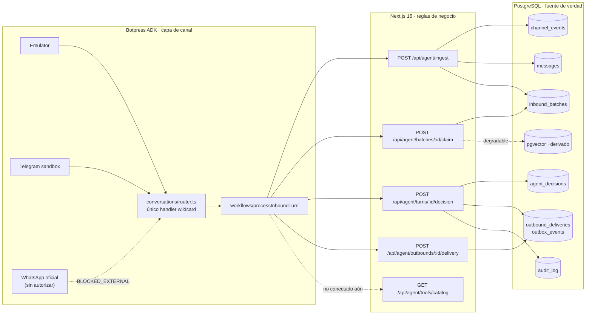
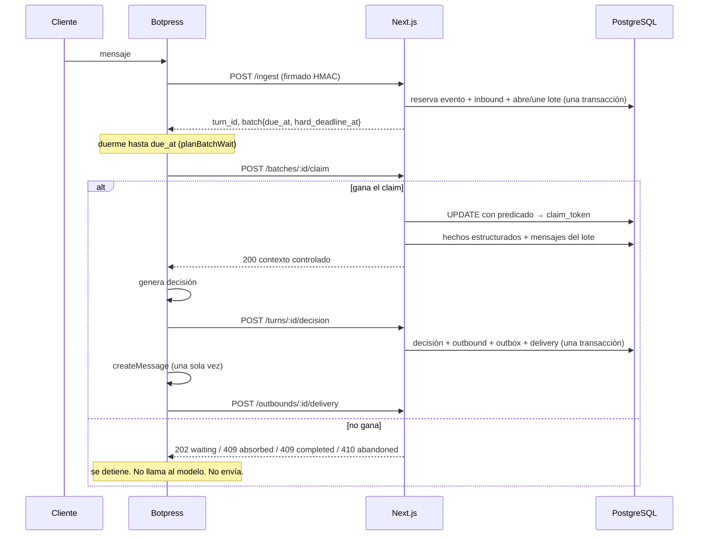
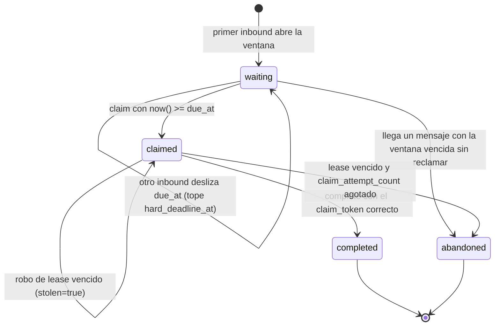

# Mapa del orquestador StudyX

Estado real del código al 2026-08-11, no el estado deseado. Cada casilla dice si
está implementada, verificada y con qué prueba. Cuando esta página y el código no
coincidan, gana el código y esta página es el bug.

## Fronteras



Botpress nunca toca PostgreSQL. No hay credenciales de base en el agente.

## Recorrido de un turno



## Estados del lote



Un solo lote `waiting` por conversación, garantizado por índice parcial único.
Un lote `claimed` con lease vencido **no** vuelve a `waiting`: chocaría con ese
índice si la conversación ya abrió otro. Se roba o se abandona.

## Estado por requisito

| Área | Estado | Dónde | Prueba |
|---|---|---|---|
| Ingesta idempotente | ✅ | `ingestion.service.ts` | `orchestration-lifecycle.test.ts` |
| Un inbound por evento externo | ✅ | `reserve_inbound_channel_event` | `database-invariants.test.ts` |
| Payloads jsonb canónicos | ✅ | `lib/db/json.ts` | `jsonb-canonical-persistence.test.ts` |
| Batching durable | ✅ | `20260811020001_inbound_batches.sql` | `inbound-batching.test.ts` |
| Claim con dueño único | ✅ | `claim_inbound_batch` | `inbound-batching.test.ts` (5 concurrentes) |
| Ventana móvil 2s / deadline 4s | ✅ | `domain/batch-window.ts` + SQL | `batch-window.test.ts` |
| Contexto sólo después del claim | ✅ | `application/claim-batch.ts` | `claim-context.test.ts` |
| Política de turno unificada | ✅ | `domain/turn-policy.ts` | `turn-policy.test.ts` |
| Degradación de pgvector/Gemini | ✅ | `claim-batch.ts` (`allSettled`) | `claim-batch.test.ts`, `claim-context.test.ts` |
| Aislamiento por contacto | ✅ | FKs compuestas + `search_contact_memory` | `claim-context.test.ts` |
| Mensajes con `embedding=skip` | ✅ | `message.service.ts` vía llamadores | `orchestration-lifecycle.test.ts` |
| Dimensión de embeddings coherente | ✅ | `EMBEDDING_DIMENSIONS` | `embedding-dimensions.test.ts` |
| Decisión idempotente y concurrente | ✅ | `decision.service.ts` | `orchestration-lifecycle.test.ts` |
| Entrega sin degradar `submitted` | ✅ | `recordDeliveryReport` | `orchestration-lifecycle.test.ts` |
| `selected_memories` | ❌ pendiente | — | — |
| Validación de memory candidates | ❌ pendiente | — | — |
| KB en el contrato de Botpress | ⚠️ parcial | la devuelve el claim; el schema ADK no la declara | — |
| Catálogo conectado al workflow | ❌ pendiente | `/api/agent/tools/catalog` existe, nadie lo llama | — |
| Decision v3 en uso | ⚠️ parcial | `decision-v3.ts` completo y probado; el commit usa v2 | `decision-v3.test.ts` |
| Workflow con claim | ❌ pendiente | `processInboundTurn` sigue sin dormir ni reclamar | — |
| Reconciliador de claims | ⚠️ parcial | `expire_inbound_batch_claims` existe; falta el cron | `inbound-batching.test.ts` |
| Reconciliador de outbox | ❌ pendiente | — | — |
| `/api/health`, `/api/ready` | ❌ pendiente | — | — |
| Audio detrás de un puerto | ❌ pendiente | `transcribeAudio` se llama directo | — |
| Pruebas de carga | ❌ pendiente | — | — |
| WhatsApp oficial | ⛔ BLOCKED_EXTERNAL | `adk check`: `state: unconfigured` | — |

## Desviaciones respecto de los planes escritos

1. El plan piloto nombra `src/conversations/emulator.ts`; el código real usa
   `router.ts` con adapters en `src/channels/`. El código es correcto: un solo
   handler wildcard, como exige `.claude/rules/botpress.md`.
2. El plan piloto congela Decision v2. La consigna vigente pide v3, que ya está
   implementada como superconjunto estricto. La migración es aditiva y pendiente.
3. `docs/ROADMAP.md` invariante 6 dice «OpenAI»; el proyecto usa Gemini.
4. `docs/FAILURE_MATRIX.md` está vacío.
5. Las Tasks 1 y 2 del plan piloto están terminadas y no se reimplementaron.

## Verificación: sin Docker

No hay runtime de contenedores en esta máquina, así que `supabase start` y todo
lo que dependa de él no corre. El sustituto es PostgreSQL 17 nativo con pgvector:

```bash
./scripts/pg-native-up.sh 55433
TEST_DATABASE_URL=postgresql://postgres@127.0.0.1:55433/studyx_test npm run test:integration
./scripts/pg-native-down.sh 55433
bash scripts/verify-native-postgres-loop.sh   # equivale a test:db:reset-loop
```

`supabase db lint` y `supabase test db` (pgTAP) siguen bloqueados por Docker.
