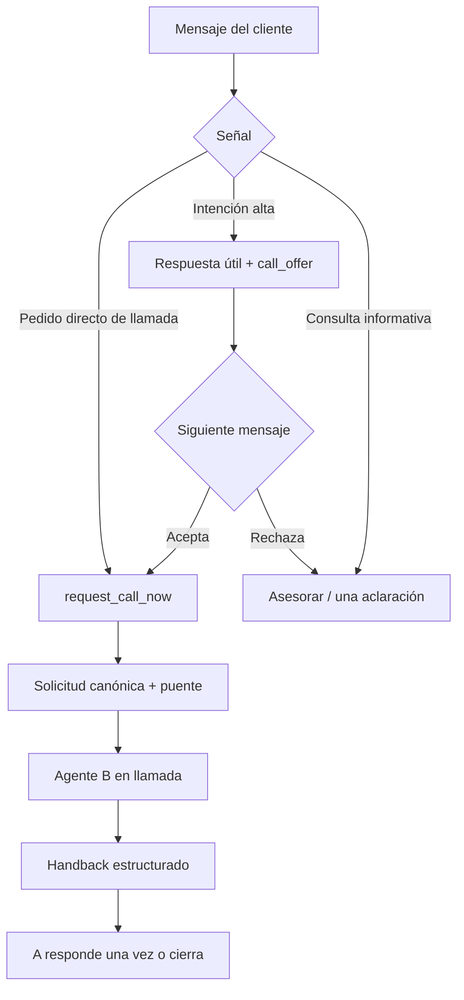

# StudyX Agent A Customer Flow Implementation Plan

> **For agentic workers:** REQUIRED SUB-SKILL: Use superpowers:subagent-driven-development (recommended) or superpowers:executing-plans to implement this plan task-by-task. Steps use checkbox (`- [ ]`) syntax for tracking.

**Goal:** Turn Agent A into a concise sales advisor that answers the customer's immediate question, detects intent, obtains explicit call consent and hands the conversation to Agent B without unnecessary qualification or lost continuity.

**Architecture:** A versioned sales-bridge prompt handles consultative language and high-intent judgment, while deterministic domain policy owns direct call requests, contextual consent, cooldowns and prohibitions. The claim context supplies structured sales/call facts, Decision v4 expresses `call_offer` or `request_call_now`, and the backend remains the final authority. During calls A defers normal messages; after calls it receives a structured handback and responds once.

**Tech Stack:** Botpress ADK 2.0.5, TypeScript 5.9, Zod, Botpress Evals, Next.js/Supabase claim context, Vitest.

**Spec:** `specs/006-agent-a-customer-flow/spec.md`; shared handoff contract in `specs/005-agent-a-b-communication/spec.md`.

## Global Constraints

- Execute after Tasks 1–4 of `docs/superpowers/plans/2026-08-16-agent-a-b-communication.md` establish Decision v4, the call ledger and the consent/state interfaces. This plan then adds the claim-time sales context.
- Agent A may offer a call; only deterministic backend policy may authorize it.
- A direct request or accepted current offer is required for `request_call_now`.
- High intent without consent produces `call_offer`, never a call request.
- The course is optional for an immediate call; phone and per-call consent are mandatory.
- A answers the customer's concrete question before a call CTA whenever an answer is available.
- One question or CTA per response; no qualification questionnaire.
- Prices and commercial facts come only from the structured catalog/knowledge base.
- Human transfer remains disabled; copy must say “asesora virtual”.
- Normal messages received during `in_progress` are deferred without an irreversible agent decision.
- Opt-out, call cancellation and “no me llames” override the sales flow immediately.
- Prompt changes require a new prompt version and a complete eval/pilot matrix run.
- Preserve existing user changes; do not deploy, push or mutate remote configuration without separate authorization.

## Flow Summary



## File Map

| Responsibility | Files |
|---|---|
| Signal policy | `src/features/orchestration/domain/sales-signal.ts`, `call-offer-policy.ts` |
| Context | orchestration store, claim application and Botpress `ClaimedTurnSchema` |
| Prompt | `botpress-agent/src/prompts/agent-a-sales-bridge.ts` |
| Fast path | `botpress-agent/src/utils/call-handoff-fast-path.ts` |
| Workflow | `botpress-agent/src/workflows/processInboundTurn.ts`, `dispatchCall.ts` |
| Post-call | `botpress-agent/src/workflows/processPostCallHandback.ts` |
| Evals | call bridge and post-call eval files plus pilot matrix |

---

### Task 1: Encode Sales Signals and Call-Offer Policy as Pure Domain Logic

**Files:**

- Create: `src/features/orchestration/domain/sales-signal.ts`
- Create: `src/features/orchestration/domain/call-offer-policy.ts`
- Create: `tests/unit/orchestration/sales-signal.test.ts`
- Create: `tests/unit/orchestration/call-offer-policy.test.ts`

**Interfaces:**

- Consumes: normalized current customer text and structured recent offer/call facts.
- Produces: a bounded deterministic signal or a policy instruction for the model.

- [ ] **Step 1: Write direct-request and negation tests**

```ts
expect(classifyDeterministicSalesSignal('Llamame ahora')).toEqual({
  type: 'direct_call_request',
});
expect(classifyDeterministicSalesSignal('Sí, pero no me llames')).toEqual({
  type: 'call_decline',
});
expect(classifyDeterministicSalesSignal('Quiero información')).toEqual({
  type: 'model_required',
});
```

- [ ] **Step 2: Write contextual-consent and cooldown tests**

Test “sí/dale/de una” with a 14-minute offer, a 16-minute offer, no offer, a prior decline and an explicit new direct request during cooldown.

- [ ] **Step 3: Implement strict signal classification**

```ts
export type DeterministicSalesSignal =
  | { type: 'direct_call_request' }
  | { type: 'call_acceptance' }
  | { type: 'call_decline' }
  | { type: 'opt_out' }
  | { type: 'model_required' };
```

Negations run before affirmative patterns. The deterministic list stays intentionally narrow; unclear language goes to `model_required` or one confirmation question.

- [ ] **Step 4: Implement the offer policy**

```ts
export interface CallOfferPolicyResult {
  allowedActions: Array<'offer_call' | 'request_call_now'>;
  openOffer: { decisionId: string; expiresAt: string } | null;
  cooldownUntil: string | null;
  reason: string;
}
```

Set offer lifetime to 15 minutes and decline cooldown to 30 minutes. Opt-out, blocked contact and active call return no sales action.

- [ ] **Step 5: Run the domain tests**

```bash
npm run test:unit -- tests/unit/orchestration/sales-signal.test.ts tests/unit/orchestration/call-offer-policy.test.ts
npm run typecheck
```

- [ ] **Step 6: Commit the sales policy**

```bash
git add src/features/orchestration/domain/sales-signal.ts src/features/orchestration/domain/call-offer-policy.ts tests/unit/orchestration/sales-signal.test.ts tests/unit/orchestration/call-offer-policy.test.ts
git commit -m "feat: define agent a call offer policy"
```

### Task 2: Supply Structured Sales and Call Context at Claim Time

**Files:**

- Modify: `src/features/orchestration/ports/orchestration-store.ts`
- Modify: `src/features/orchestration/adapters/postgres-orchestration-store.ts`
- Modify: `src/features/orchestration/application/claim-batch.ts`
- Modify: `botpress-agent/src/schemas/contracts.ts`
- Modify: `tests/unit/orchestration/claim-batch.test.ts`
- Modify: `tests/integration/claim-context.test.ts`
- Modify: `tests/contract/botpress-response-parity.test.ts`

**Interfaces:**

- Consumes: canonical decisions, call sessions and latest call result.
- Produces: `sales_context` in every claimed turn.

- [ ] **Step 1: Add the failing contract expectation**

```ts
expect(claimed.sales_context).toEqual({
  mode: 'advising',
  course_of_interest: null,
  open_call_offer: null,
  active_call: null,
  allowed_actions: ['offer_call'],
  last_call_result: null,
});
```

- [ ] **Step 2: Define the exact claim shape**

```ts
export interface ClaimedSalesContext {
  mode: 'advising' | 'awaiting_call_consent' | 'call_pending' | 'in_call' | 'post_call';
  course_of_interest: string | null;
  open_call_offer: { decision_id: string; expires_at: string } | null;
  active_call: { call_id: string; status: string } | null;
  allowed_actions: Array<'offer_call' | 'request_call_now'>;
  last_call_result: { call_id: string; result: string | null; ended_at: string } | null;
}
```

Do not expose phone, provider credentials, raw transcripts or unbounded call analysis.

- [ ] **Step 3: Load the facts in bounded PostgreSQL queries**

Derive the current offer from the latest immutable `agent_decisions` row with `response_type='call_offer'`; derive active/last call from `call_sessions`. Scope every query through the claimed batch's canonical `contact_id` and `conversation_id`.

- [ ] **Step 4: Apply domain policy in the claim application**

The adapter returns facts; `claim-batch.ts` calls the pure policy and constructs `allowed_actions`. A database outage remains fatal; missing call rows simply produce the default advising context.

- [ ] **Step 5: Run claim and parity checks**

```bash
npm run test:unit -- tests/unit/orchestration/claim-batch.test.ts
TEST_DATABASE_URL=postgresql://postgres@127.0.0.1:55433/studyx_test npm run test:integration -- tests/integration/claim-context.test.ts
npm run test -- tests/contract/botpress-response-parity.test.ts
```

- [ ] **Step 6: Commit the controlled context**

```bash
git add src/features/orchestration/ports/orchestration-store.ts src/features/orchestration/adapters/postgres-orchestration-store.ts src/features/orchestration/application/claim-batch.ts botpress-agent/src/schemas/contracts.ts tests/unit/orchestration/claim-batch.test.ts tests/integration/claim-context.test.ts tests/contract/botpress-response-parity.test.ts
git commit -m "feat: expose call context to agent a"
```

### Task 3: Extract and Version the Agent A Sales-Bridge Prompt

**Files:**

- Create: `botpress-agent/src/prompts/agent-a-sales-bridge.ts`
- Modify: `botpress-agent/src/workflows/processInboundTurn.ts`
- Create: `tests/unit/botpress/agent-a-sales-bridge-prompt.test.ts`
- Modify: `docs/PILOT_MATRIX.md`

**Interfaces:**

- Consumes: `ClaimedTurn`, structured catalog and `sales_context`.
- Produces: `buildAgentASalesBridgeInstructions` and prompt version `studyx-agent-a-sales-bridge-v1`.

- [ ] **Step 1: Write structural prompt tests**

Assert that instructions require answer-first behavior, one question/CTA, virtual-advisor disclosure, catalog grounding, `allowed_actions` compliance and untrusted context fencing. Assert they do not contain the obsolete claim that no call path exists.

- [ ] **Step 2: Create five explicit prompt blocks**

```ts
export const AGENT_A_PROMPT_VERSION = 'studyx-agent-a-sales-bridge-v1';

export function buildAgentASalesBridgeInstructions(
  claimed: ClaimedTurn,
  catalog: CatalogResponse | null,
): string;
```

Build identity/scope, hard commercial rules, call policy, style/copy and bounded untrusted context as separate constants/functions in the same focused file.

- [ ] **Step 3: Encode the commercial behavior**

The model must:

- answer the actual question before a CTA;
- ask at most one question or CTA;
- offer a call on high intent in the same turn;
- use `call_offer`, not `request_call_now`, without explicit consent;
- say “asesora virtual” rather than promise a human;
- leave the course optional for a direct request;
- avoid claiming provider acceptance or payment without structured evidence.

- [ ] **Step 4: Replace the monolithic builder without changing transport logic**

Import the new builder/version into `processInboundTurn.ts`. Keep catalog fencing, recent-turn bounds, model chain, temperature and structured exit unchanged in this task.

- [ ] **Step 5: Run prompt, type and ADK checks**

```bash
npm run test:unit -- tests/unit/botpress/agent-a-sales-bridge-prompt.test.ts
npm run typecheck
(cd botpress-agent && npm run typecheck && npm run check)
```

- [ ] **Step 6: Commit the versioned playbook**

```bash
git add botpress-agent/src/prompts/agent-a-sales-bridge.ts botpress-agent/src/workflows/processInboundTurn.ts tests/unit/botpress/agent-a-sales-bridge-prompt.test.ts docs/PILOT_MATRIX.md
git commit -m "feat: add versioned agent a sales bridge prompt"
```

### Task 4: Add Deterministic Call Handoff Fast Paths

**Files:**

- Create: `botpress-agent/src/utils/call-handoff-fast-path.ts`
- Modify: `botpress-agent/src/workflows/processInboundTurn.ts`
- Create: `tests/unit/botpress/call-handoff-fast-path.test.ts`

**Interfaces:**

- Consumes: current batch text and `sales_context.allowed_actions`.
- Produces: a complete Decision v4 or `null` before catalog/model execution.

- [ ] **Step 1: Write the fast-path matrix**

Cover direct “llamame”, accepted current offer, “sí” without offer, explicit decline, mixed affirmative/negation, opt-out and active call.

- [ ] **Step 2: Implement the pure matcher**

```ts
export function matchCallHandoffFastPath(
  claimed: ClaimedTurn,
): DecisionV4 | null;
```

For an allowed request, return:

```ts
{
  schema_version: 4,
  intent: 'commercial',
  kind: 'reply',
  response: 'Perfecto. Registré la llamada; nuestra asesora virtual intenta comunicarse ahora.',
  response_type: 'call_confirmation',
  confidence: 1,
  reason_code: 'CALL_CONSENT_ACCEPTED',
  business_action: {
    type: 'request_call_now',
    reason: 'accepted_offer',
  },
  memory_candidates: [],
  missing_information: [],
  next_state: 'completed',
  retrieval_used: { kb: false, long_term_memory: false, summary_version: null },
}
```

Use `direct_request` when the inbound itself asks for the call.

- [ ] **Step 3: Place the fast path before catalog/model**

After a successful claim and before `lookupCatalog`, evaluate greeting first for pure greetings and call handoff for explicit call input. Log only `trace_id`, `turn_id`, path name and elapsed milliseconds.

- [ ] **Step 4: Prove zero model/catalog usage**

Mock both operations and assert they are not called for accepted/direct handoff, while an ambiguous “sí” falls through to clarification.

- [ ] **Step 5: Run the fast-path suite**

```bash
npm run test:unit -- tests/unit/botpress/call-handoff-fast-path.test.ts
(cd botpress-agent && npm run typecheck && npm run check)
```

- [ ] **Step 6: Commit the latency path**

```bash
git add botpress-agent/src/utils/call-handoff-fast-path.ts botpress-agent/src/workflows/processInboundTurn.ts tests/unit/botpress/call-handoff-fast-path.test.ts
git commit -m "perf: fast path explicit call consent"
```

### Task 5: Teach the Model to Advise, Detect Intent and Offer the Call

**Files:**

- Modify: `botpress-agent/src/prompts/agent-a-sales-bridge.ts`
- Modify: `botpress-agent/src/schemas/contracts.ts`
- Modify: `botpress-agent/evals/conversational-matrix.eval.ts`
- Create: `botpress-agent/evals/agent-a-call-bridge.eval.ts`
- Create: `tests/unit/orchestration/decision-v4-policy.test.ts`

**Interfaces:**

- Consumes: normal model-required turns.
- Produces: grounded commercial reply, `call_offer`, clarification or no-sales response.

- [ ] **Step 1: Replace the contradictory human-promise assertions**

Keep prohibitions against “humano”, “persona del equipo” and false transfer. Allow only explicit virtual-call wording such as “asesora virtual”.

- [ ] **Step 2: Add high/medium/informational eval cases**

Required turns:

- “Quiero anotarme a Python” → useful answer plus call offer;
- “¿Cuánto sale?” with verified catalog → price first, then optional call offer;
- “Quiero información” → one clarification, no forced call;
- “Prefiero seguir por acá” → no repeat offer;
- support/complaint/current student → no commercial call action.

- [ ] **Step 3: Enforce the offer shape**

`response_type='call_offer'` requires `kind='reply'`, `next_state='waiting_user'`, a question mark and `business_action=null`. `request_call_now` remains restricted to `call_confirmation`.

- [ ] **Step 4: Keep facts and persuasion separated**

The prompt may recommend a call based on intent, but course claims, price, promotion, duration and certificates must still come from `catalog`/`knowledge_base`. A missing catalog may produce an offer to clarify by phone but may not invent a number.

- [ ] **Step 5: Run local deterministic and discoverable eval checks**

```bash
npm run test:unit -- tests/unit/orchestration/decision-v4-policy.test.ts
(cd botpress-agent && npm run typecheck && npm run check && npm run evals)
```

If Botpress Evals remains blocked by the external Chat integration, record the exact blocker in `docs/PILOT_MATRIX.md`; unit/contract gates still must pass.

- [ ] **Step 6: Commit the call-offer behavior**

```bash
git add botpress-agent/src/prompts/agent-a-sales-bridge.ts botpress-agent/src/schemas/contracts.ts botpress-agent/evals/conversational-matrix.eval.ts botpress-agent/evals/agent-a-call-bridge.eval.ts tests/unit/orchestration/decision-v4-policy.test.ts
git commit -m "feat: offer immediate virtual sales calls"
```

### Task 6: Dispatch the Canonical Call Without Slowing the Conversation

**Files:**

- Create: `botpress-agent/src/actions/dispatchCall.ts`
- Modify: `botpress-agent/src/workflows/processInboundTurn.ts`
- Modify: `botpress-agent/src/schemas/contracts.ts`
- Create: `tests/unit/botpress/dispatch-call-action.test.ts`
- Modify: `tests/integration/agent-a-call-handoff.test.ts`

**Interfaces:**

- Consumes: `committed.call_request.call_id` from the backend.
- Produces: one signed `/api/agent/calls/:call_id/dispatch` request and a recoverable workflow result.

- [ ] **Step 1: Write signed request and replay tests**

Assert the action uses `idempotency-key=call-dispatch:<call_id>`, reuses `trace_id`, signs the exact body and retries only a confirmed transient response. A timeout is reported as ambiguous and is not retried in Botpress.

- [ ] **Step 2: Implement the action with the existing HTTP helper**

```ts
export interface DispatchCallInput {
  call_id: string;
  trace_id: string;
}
```

Return `provider_accepted | dispatch_ambiguous | failed | duplicate`; never return phone or provider secrets.

- [ ] **Step 3: Invoke after canonical commit**

When `call_request` is present, start the dispatch step immediately and keep the WhatsApp bridge message delivery on its existing fenced path. A dispatch failure does not erase the already-valid consent/session; the call reconciler owns recovery.

- [ ] **Step 4: Prove one call under workflow replay**

Resume the workflow at every boundary and assert one call session, one provider acceptance and one bridge message.

- [ ] **Step 5: Run action and integration checks**

```bash
npm run test:unit -- tests/unit/botpress/dispatch-call-action.test.ts
TEST_DATABASE_URL=postgresql://postgres@127.0.0.1:55433/studyx_test npm run test:integration -- tests/integration/agent-a-call-handoff.test.ts
(cd botpress-agent && npm run typecheck && npm run check)
```

- [ ] **Step 6: Commit Agent A dispatch**

```bash
git add botpress-agent/src/actions/dispatchCall.ts botpress-agent/src/workflows/processInboundTurn.ts botpress-agent/src/schemas/contracts.ts tests/unit/botpress/dispatch-call-action.test.ts tests/integration/agent-a-call-handoff.test.ts
git commit -m "feat: dispatch agent b from agent a workflow"
```

### Task 7: Design Customer-Facing Pending, Active, Failure and Handback Responses

**Files:**

- Create: `botpress-agent/src/prompts/agent-a-post-call.ts`
- Modify: `botpress-agent/src/workflows/processPostCallHandback.ts`
- Create: `tests/unit/botpress/agent-a-post-call-prompt.test.ts`
- Create: `botpress-agent/evals/agent-a-post-call.eval.ts`
- Modify: `docs/PILOT_MATRIX.md`

**Interfaces:**

- Consumes: structured `PostCallRoute`, deferred messages and verified outcome facts.
- Produces: one safe customer-facing handback decision.

- [ ] **Step 1: Freeze the response table**

Use these intents:

| State/result | Copy objective |
|---|---|
| `requested/provider_accepted` | Confirm attempt; do not claim the customer answered. |
| `in_progress` | No normal A reply; store the message. |
| `no_answer/busy/failed/timed_out` | Offer a new attempt or continue by text. |
| `link_enviado_sin_pago` | Refer to the sent link without saying payment succeeded. |
| verified payment | Explain next concrete step, without reselling. |
| `no_interesado` | Close once, no retention push. |
| `no_contactar` | No proactive message. |
| analysis absent | Neutral continuation; no commercial inference. |

- [ ] **Step 2: Build a bounded post-call prompt**

It receives only route type, verified structured facts and ordered deferred messages. It must answer deferred messages first and combine handback in one response.

- [ ] **Step 3: Add evals for repetition and contradiction**

Assert A does not ask again for course/email already present, does not say “pagaste” without verification, does not redial automatically and sends no second follow-up when analysis arrives late.

- [ ] **Step 4: Run post-call checks**

```bash
npm run test:unit -- tests/unit/botpress/agent-a-post-call-prompt.test.ts
(cd botpress-agent && npm run typecheck && npm run check && npm run evals)
```

- [ ] **Step 5: Commit the customer handback flow**

```bash
git add botpress-agent/src/prompts/agent-a-post-call.ts botpress-agent/src/workflows/processPostCallHandback.ts tests/unit/botpress/agent-a-post-call-prompt.test.ts botpress-agent/evals/agent-a-post-call.eval.ts docs/PILOT_MATRIX.md
git commit -m "feat: add agent a post call customer flow"
```

### Task 8: Run the Agent A Conversation Pilot and Tune by Evidence

**Files:**

- Modify: `docs/PILOT_MATRIX.md`
- Modify: `docs/PILOT_RUNBOOK.md`
- Modify: `docs/FAILURE_MATRIX.md`
- Create: `docs/evidence/agent-a-sales-bridge-pilot.md`

**Interfaces:**

- Consumes: complete local/fake A→B lifecycle and the versioned prompt.
- Produces: an approval record for supervised traffic.

- [ ] **Step 1: Run every deterministic gate**

```bash
npm run test
TEST_DATABASE_URL=postgresql://postgres@127.0.0.1:55433/studyx_test npm run test:integration
npm run typecheck
npm run lint
npm run build
(cd botpress-agent && npm run typecheck && npm run check)
```

- [ ] **Step 2: Execute the conversational matrix**

Run at least three phrasing variants for greeting, general information, concrete question, high intent, direct request, contextual acceptance, ambiguous yes, decline, opt-out, no-answer, during-call message and post-call handback.

- [ ] **Step 3: Measure the agreed outcomes**

Record call-offer same-turn rate for high-intent inputs, consent-to-request latency, duplicate calls, deferred-message recovery, repeated A/B questions, invented facts and opt-out violations.

- [ ] **Step 4: Tune one variable per prompt version**

If behavior changes, increment `studyx-agent-a-sales-bridge-v1` to the next explicit version and rerun the full matrix. Never mix evidence from two prompt versions in one pass/fail row.

- [ ] **Step 5: Apply the supervised release gate**

Enable only when all deterministic cases pass, direct requests use the fast path, no consent false positive appears, no duplicate call/message appears and the kill switch is documented and tested.

- [ ] **Step 6: Commit the pilot evidence**

```bash
git add docs/PILOT_MATRIX.md docs/PILOT_RUNBOOK.md docs/FAILURE_MATRIX.md docs/evidence/agent-a-sales-bridge-pilot.md
git commit -m "test: validate agent a sales bridge flow"
```
