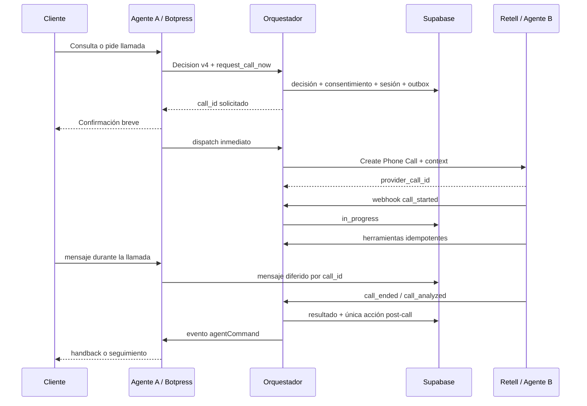

# Spec — Comunicación Agente A ↔ Agente B

## Objetivo

Conectar el Agente A de WhatsApp/Botpress con el Agente B de voz/Retell sin
estado oculto ni llamadas directas entre agentes. El backend y PostgreSQL son
el punto de coordinación antes, durante y después de cada llamada.

La prioridad comercial es reducir al mínimo el tiempo entre un consentimiento
explícito y el discado, sin sacrificar idempotencia, consentimiento ni
recuperación ante fallos parciales.

## Decisiones congeladas

1. A y B nunca se invocan ni comparten memoria directamente.
2. A propone una acción tipada; Next.js la valida y Supabase crea la sesión.
3. Retell sólo recibe un snapshot acotado. Nunca recibe el historial completo.
4. El consentimiento de WhatsApp no equivale a consentimiento de llamada.
5. El consentimiento de voz es por llamada y queda ligado al mensaje fuente.
6. `contact_id`, teléfono, `call_id` y consentimiento se derivan en el backend;
   nunca se aceptan desde la salida del modelo.
7. Los eventos de proveedor forman un ledger append-only. La proyección de
   estado se recalcula desde el ledger completo para tolerar desorden.
8. Un timeout de dispatch es ambiguo: no se vuelve a discar hasta consultar al
   proveedor por el `call_id` interno.
9. Los mensajes recibidos mientras B habla se persisten y difieren; no se crea
   una decisión terminal `suppress` que impida responderlos después.
10. El flujo humano continúa deshabilitado hasta que exista una cola con dueño,
    SLA y disponibilidad real. El Agente B es una asesora virtual.
11. El sandbox usa el proveedor de voz Telegram y conserva el candado que
    impide efectos reales sobre identidades sintéticas.
12. Las migraciones son aditivas y PostgreSQL sigue siendo la fuente de verdad.

## Responsabilidades

| Componente | Responsabilidad |
|---|---|
| Agente A | Asesorar brevemente, ofrecer llamada y proponer `request_call_now`. |
| Backend | Validar consentimiento, teléfono, bloqueo, concurrencia y sandbox. |
| Supabase | Persistir sesión, eventos, herramientas, diferidos y handback. |
| Proveedor de voz | Discar o simular la llamada y devolver identidad externa. |
| Agente B | Conversar, consultar herramientas y registrar resultado. |
| Router post-call | Reconciliar resultado, liberar diferidos y decidir una acción. |
| Botpress | Ejecutar comandos de canal autorizados y retomar el diálogo. |

## Contrato A → backend

La incorporación de una llamada ejecutable requiere `Decision v4`. El parser
de v3 se conserva para compatibilidad. V4 agrega los response types
`call_offer` y `call_confirmation`; no cambia el significado de los response
types anteriores.

```ts
export type RequestCallNowAction = {
  type: 'request_call_now';
  reason: 'direct_request' | 'accepted_offer';
  course_of_interest?: string;
};
```

Reglas:

- `direct_request` exige que el lote actual contenga un pedido explícito de
  llamada.
- `accepted_offer` exige una oferta `call_offer` vigente y una aceptación
  inequívoca posterior.
- `call_offer` siempre lleva `business_action=null` y espera respuesta.
- El curso es opcional. B puede descubrirlo durante la llamada.
- La respuesta de A debe usar `response_type='call_confirmation'`.
- La acción nunca contiene teléfono, IDs canónicos ni evidencia elegida por el
  modelo.

## Evidencia de consentimiento

El backend ejecuta una política determinista y registra:

```ts
export interface VoiceConsentEvidence {
  source_message_id: string;
  mode: 'direct_request' | 'accepted_offer';
  offered_by_decision_id: string | null;
  captured_at: string;
}
```

Una aceptación breve como “sí” sólo vale cuando existe una oferta de llamada
vigente en la misma conversación. Una negación dentro del mismo texto siempre
gana: “sí, pero no me llames” no otorga consentimiento.

## Sesión de llamada

Los eventos existentes conservan sus cuatro nombres. `CallEvent v2` agrega
`trace_id` y `provider_call_id`; el parser v1 permanece disponible mientras se
drenan fixtures o eventos anteriores.

```ts
export type CallStatus =
  | 'requested'
  | 'dispatching'
  | 'provider_accepted'
  | 'dispatch_ambiguous'
  | 'in_progress'
  | 'completed'
  | 'failed'
  | 'no_answer'
  | 'timed_out'
  | 'cancelled';

export type AnalysisStatus = 'pending' | 'completed' | 'failed';
```

`analysis_status` es ortogonal a `status`: una llamada puede haber terminado y
su análisis llegar después.

La proyección se calcula con precedencia semántica, no con el orden de llegada:

1. cancelación canónica;
2. evento `ended` y su causa técnica;
3. evento `started`;
4. aceptación del proveedor;
5. solicitud persistida.

El evento `analyzed` actualiza `analysis_status` y el resultado comercial, pero
no reescribe la causa técnica de finalización.

## Contexto enviado a B

Retell recibe valores string y acotados:

```ts
export interface CallContextV1 {
  call_id: string;
  nombre_lead: string;
  curso_interes: string;
  pais: string;
  email_lead: string;
  resumen_whatsapp: string;
  prompt_version: string;
}
```

`resumen_whatsapp` tiene máximo 1.200 caracteres, no contiene instrucciones,
datos de pago ni secretos. `call_id` es la única clave que B necesita para que
el backend derive el resto de la identidad.

## Ciclo completo



## Comunicación B → A durante la llamada

B no crea mensajes WhatsApp directamente. Sus herramientas crean comandos
canónicos con una clave idempotente:

```ts
export interface VoiceToolRequestV1 {
  schema_version: 1;
  tool_call_id: string;
  call_id: string;
  tool_name:
    | 'consultar_curso'
    | 'consultar_oferta'
    | 'guardar_datos_contacto'
    | 'enviar_material'
    | 'registrar_resultado';
  occurred_at: string;
  arguments: unknown;
}
```

Cuando una herramienta necesita WhatsApp, el backend crea un `agent_command`.
Un evento custom de Botpress despierta un trigger, reclama el comando y usa
`getOrCreateMessage` con `studyxCommandId` para impedir un doble envío.

Pago, agenda y transferencia humana permanecen cerrados hasta contar con su
propio contrato, proveedor y pruebas de efecto externo.

## Mensajes durante llamada

- Siempre se persisten como mensajes canónicos.
- Opt-out, cancelación de llamada y “no me llames” se procesan de inmediato.
- El resto se asocia a `call_id` en `call_deferred_messages`.
- No se ejecutan modelo, catálogo ni búsqueda semántica.
- Al finalizar B, los diferidos se agrupan en orden y se entregan una sola vez
  al flujo post-call de A.

## Router post-call

El router espera `ended + analyzed` por un plazo acotado. Si el análisis no
llega, actúa sólo con hechos técnicos y nunca infiere venta.

| Resultado | Acción de A |
|---|---|
| `venta_confirmada` | Confirmación postventa sólo si el pago está verificado. |
| `link_enviado_sin_pago` | Seguimiento de pago, una vez. |
| `seguimiento_agendado` | Registrar y respetar fecha/canal acordados. |
| `no_answer`, `busy`, `failed_to_connect`, `timed_out` | Ofrecer reintento; nunca rediscado automático. |
| `no_interesado` | Cierre cordial, sin insistencia. |
| `no_contactar` | Revocar contacto y no enviar seguimiento. |
| análisis ausente | Continuidad neutra, sin afirmar resultado comercial. |

## Objetivos operativos

- p50 consentimiento → solicitud canónica: menor a 2 segundos.
- p95 solicitud → aceptación del proveedor: menor a 10 segundos.
- llamadas duplicadas: 0.
- mensajes perdidos durante llamada: 0.
- seguimientos post-call duplicados: 0.
- webhooks Retell aceptados sin firma válida: 0.
- contenido sensible en logs estructurados: 0.

Los primeros umbrales de espera son defaults de diseño: oferta vigente por 15
minutos, cooldown de 30 minutos y espera post-call de análisis de 30 segundos.
Se ajustan únicamente con evidencia del piloto y una nueva versión de spec.

## Fuera de alcance

- Transferencia a un humano.
- Pago autónomo y verificación financiera.
- Agenda recurrente compleja.
- Un CRM generalista o múltiples oportunidades simultáneas por contacto.
